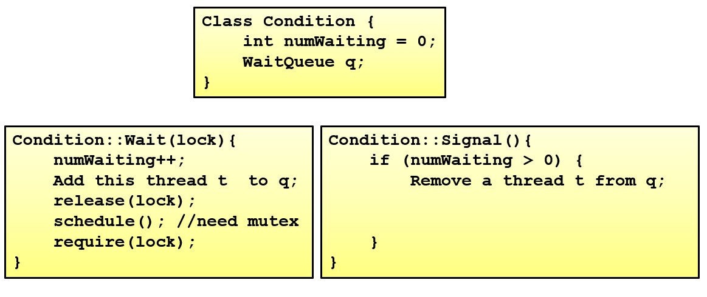
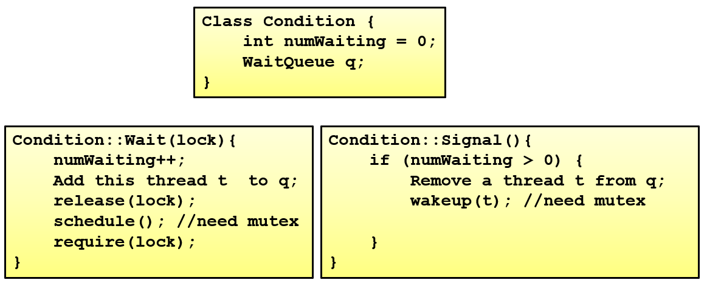
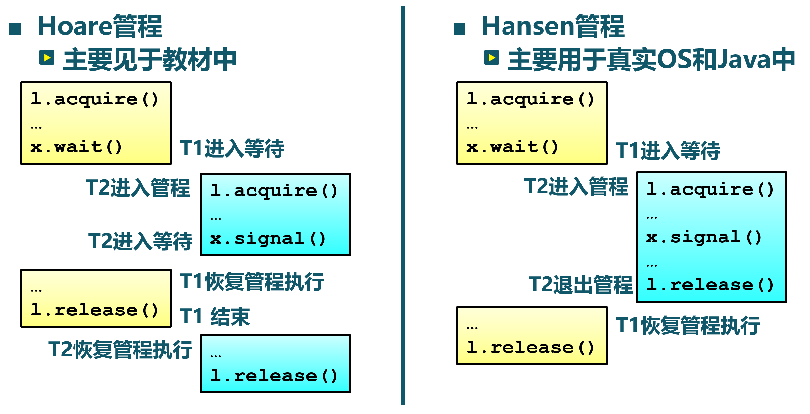
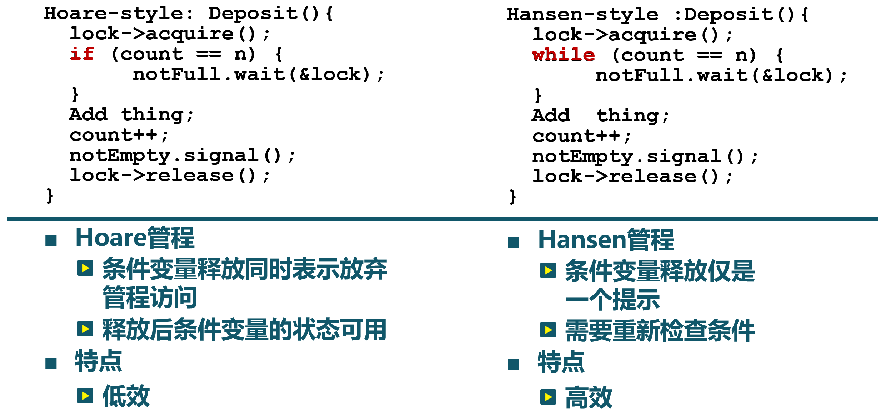
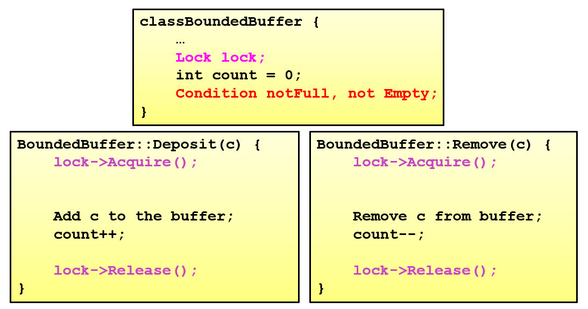
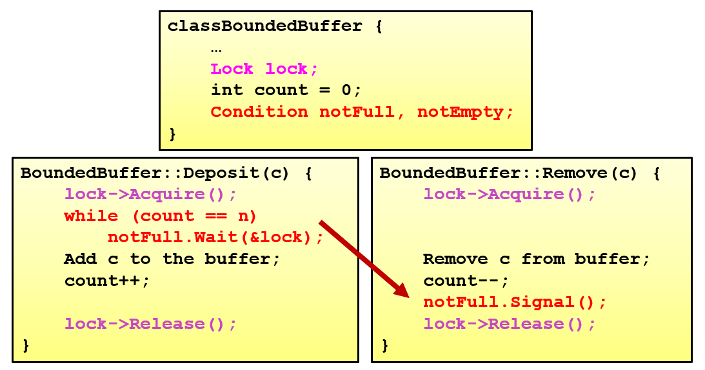
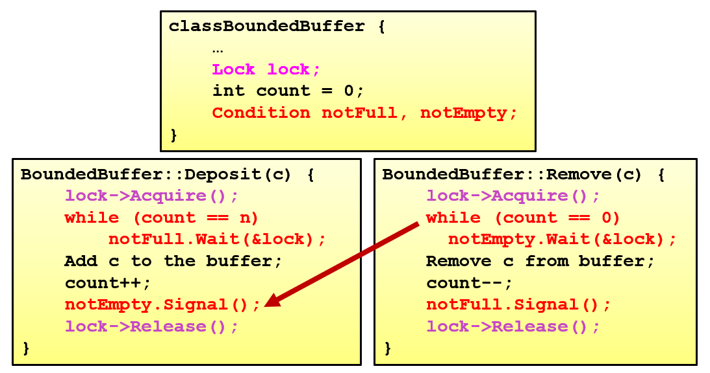

<!-- theme: gaia -->
<!-- _class: lead -->

# 第十二讲 同步与互斥

## 第三节 管程（Moniter）

---
### 管程
- 管程是一种用于多线程互斥访问共享资源的程序结构
- 采用面向对象方法，简化了线程间的同步控制
- 任一时刻最多只有一个线程执行管程代码
- 正在管程中的线程可临时放弃管程的互斥访问，等待事件出现时恢复

---
### 管程 -- 条件变量
- 管程的组成
   - 一个锁：控制管程代码的互斥访问
   - 0或者多个条件变量: 管理共享数据的并发访问
- 条件变量是管程内的等待机制
   - 进入管程的线程因资源被占用而进入等待状态
   - 每个条件变量表示一种等待原因，对应一个等待队列

---
### 管程 -- 条件变量
- 条件变量是管程内的等待机制
- Wait()操作
   - 将自己阻塞在等待队列中
   - 唤醒一个等待者或释放管程的互斥访问
- Signal()操作
   - 将等待队列中的一个线程唤醒
   - 如果等待队列为空，则等同空操作

---
### 管程 -- 实现条件变量

---
### 管程 -- 实现条件变量

---
### 管程 -- 实现条件变量

---
### 管程 -- 实现条件变量

---
### 管程 -- 实现条件变量

---
### 管程 -- 实现条件变量

---
### 管程 -- 实现条件变量

---
### 管程 -- 实现条件变量

---
### 管程 -- 实现条件变量

---
### 管程 
管程中条件变量的释放处理方式

---
### 管程 
管程中条件变量的释放处理方式

---
### 管程 
管程中条件变量的释放处理方式

---
### 管程 -- 生产者-消费者问题

---
### 管程 -- 生产者-消费者问题

---
### 管程 -- 生产者-消费者问题

---
### 管程 -- 生产者-消费者问题

