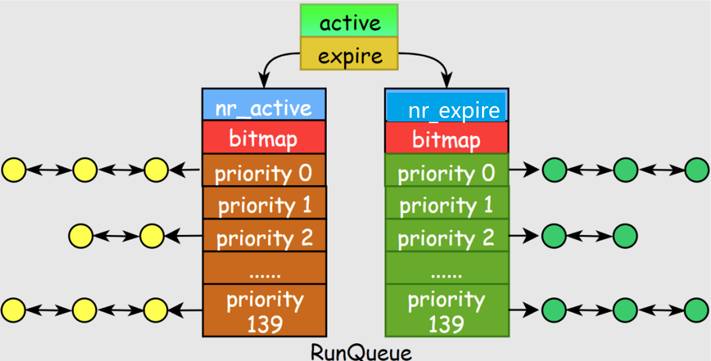

<!-- theme: gaia -->
<!-- _class: lead -->

## 第八讲 多处理器调度

### 第三节 Linux O(1) 调度

---
### SMP 和 早期Linux 内核

---
### SMP 和 早期Linux 内核
调度器需要考虑的关键问题：
- 采用何种数据结构来组织进程
- 如何根据进程优先级来确定进程运行时间
- 如何判断进程类型(I/O密集，CPU密集型，实时，非实时)
- 如何确定进程的动态优先级：影响因素
  - 静态优先级、nice值
  - I/O密集型和CPU密集型产生的优先级奖惩
- 如何适配多处理器情况

---
### SMP 和 早期Linux 内核

<!-- https://courses.engr.illinois.edu/cs423/sp2018/slides/13-linux-schedulers.pdf -->
Linux历史

- Linux 1.2: 环形队列 + Round Robin调度策略
- 在 Linux 2.0 的早期，SMP 支持由一个“大锁”组成，这个“大锁”对操作系统内部的访问进行串行化
- 在 2.2 前的内核中，在用户态可支持并行，Linux 内核本身并不能因为有多个处理器而得到加速
- 在 2.2 前的内核中，引入调度类（real-time, non-real-time）
<!--   -->

<!-- 调度器简介，以及Linux的调度策略 https://www.cnblogs.com/vamei/p/9364382.html -->

<!-- 万字长文，锤它！揭秘Linux进程调度器 https://www.eet-china.com/mp/a111242.html -->
---
### Linux 2.4 内核：SMP 实现在内核态

---
### Linux 2.4 内核：SMP 实现在内核态
- 使用多处理器可以加快内核的处理速度，调度器是复杂度为 O(n)
  - $O(n)$ 这个名字，来源于算法复杂度的大$O$表示法 
  - 字母$n$在这里代表操作系统中的活跃进程数量
  - $O(n)$ 表示这个调度器的时间复杂度和活跃进程的数量成正比

---
### Linux 2.4 内核：SMP 实现在内核态
$O(n)$ 调度算法的基本思路
- 把时间分成大量的微小时间片（Epoch）
- 在每个时间片开始的时候，调度器会检查所有处在就绪状态的进程
- 调度器计算每个进程的优先级，然后选择优先级最高的进程来执行
- 一旦进程被调度器切换执行，进程可以不被打扰地用尽这个时间片
- 如果进程没有用尽时间片，那么该时间片的剩余时间会增加到进程的下一个时间片中

<!-- 谈谈调度 - Linux O(1) https://cloud.tencent.com/developer/article/1077507?from=article.detail.1603917 
Linux Kernel 排程機制介紹
https://loda.hala01.com/2017/06/linux-kernel.html
-->
---
### Linux 2.4 内核：SMP 实现在内核态
$O(n)$ 调度算法的复杂度为O(n)的原因：
- $O(n)$调度器在每次使用时间片前都要检查所有就绪进程的优先级
- 这个检查时间和进程中进程数目$n$成正比

---
### Linux 2.4 内核：SMP 实现在内核态

数据结构
- 只用一个 global runqueue放置就绪任务
- 各个 core 需要竞争同一个 runqueue 里面的任务

---
### Linux 2.4 内核：SMP 实现在内核态

缺点：
- $O(n)$的执行开销
   - 当有大量进程在运行时，这个调度器的性能将会被大大降低
- 多处理器竞争访问同一个 runqueue 里面的任务
   - $O(n)$调度器没有很好的可扩展性(scalability)

<!-- ---
### Linux 2.4 内核：SMP 实现在内核态
- 使用多处理器可以加快内核的处理速度，调度器是复杂度为 O(n)
  - 内核调度器维护两个 queue：runqueue 和 expired queue
  - 两个 queue 都永远保持有序
  - 一个 process 用完时间片，就会被插入 expired queue
  - 当 runqueue 为空时，把 runqueue 和 expired queue 交换一下
 

---
### Linux 2.4 内核：SMP 实现在内核态
- 使用多处理器可以加快内核的处理速度，调度器是复杂度为 O(n)
  - 全局共享的就绪队列
  - 寻找下一个可执行的 process，这个操作一般都是 O(1)
  - 每次进程用完时间片，找合适的位置执行插入操作，会遍历所有任务，复杂度为O(n)
 

---
### Linux 2.4 内核：SMP 实现在内核态
- 使用多处理器可以加快内核的处理速度，调度器是复杂度为 O(n)
  - 现代操作系统都能运行成千上万个进程
  - O(n) 算法意味着每次调度时，对于当前执行完的process，需要把所有在 expired queue 中的 process 过一遍，找到合适的位置插入
  - 这不仅仅会带来性能上的巨大损失，还使得系统的调度时间非常不确定 -- 根据系统的负载，可能有数倍甚至数百倍的差异
    -->

<!-- 万字长文，锤它！揭秘Linux进程调度器 https://www.eet-china.com/mp/a111242.html -->
---
### Linux O(1) 调度器
Linux 2.6 版本的调度器是由 Ingo Molnar 设计并实现的。他编写这个新调度器的动机是为唤醒、上下文切换和定时器中断开销建立一个完全 O(1) 的调度器
 

---
### Linux O(1) 调度器
特点：
- 实现了per-cpu-runqueue，每个CPU都有一个就绪进程任务队列
- 采用全局优先级：实时进程0-99，普通进程100-139

 

---
### Linux O(1) 调度器
特点：
- 引入活跃数组active和过期数组expire，放置就绪进程和过期进程
 
---
### Linux O(1) 调度器
特点：
- 每个优先级对应一个链表，引入bitmap数组来记录140个链表中的活跃进程情况
 

  
---
### Linux O(1) 调度器
- 满足 O(1) 的数据结构？
- 回顾一下数据结构的四种基本操作和时间复杂度
  - access：随机访问
    - array: 平均情况和最坏情况均能达到 O(1)
    - linked list 是 O(N)
    - tree 一般是 O(log N)
 

  
---
### Linux O(1) 调度器
- 满足 O(1) 的数据结构？
- 回顾一下数据结构的四种基本操作和时间复杂度
  - search：搜索
    - hash table 时间复杂度是 O(1)，但它最坏情况下是 O(N)
    - 大部分 tree（b-tree / red-black tree）平均和最坏情况都是 O(log N)
 

  
---
### Linux O(1) 调度器
- 满足 O(1) 的数据结构？
- 回顾一下数据结构的四种基本操作和时间复杂度
  - insert/deletion：插入和删除
    - hash table 时间复杂度是 O(1)，但它最坏情况下是 O(N)
    - linked list，stack，queue 在平均和最坏情况下都是 O(1)

 

    
---
### Linux O(1) 调度器

- 进程有 140 种优先级，可用长度为 140 的 array 去记录优先级。access 是 O(1)
- 每个优先级下面用一个FIFO queue 管理这个优先级下的 process。新来的插到队尾，先进先出，insert/deletion 都是 O(1)

 

    
---
### Linux O(1) 调度器

- 进程有 140 种优先级，可用长度为 140 的 array 去记录优先级。access 是 O(1)
- bitarray，它为每种优先级分配一个 bit，如果这个优先级队列下面有 process，那么就对相应的 bit 染色，置为 1，否则置为 0。
- 问题就简化成寻找一个 bitarray 里面最高位是 1 的 bit（left-most bit），这基本上是一条CPU 指令的事。

 

    
---
### Linux O(1) 调度器

<!-- Linux 是如何调度进程的？https://jishuin.proginn.com/p/763bfbd2df25 -->

O(1) 调度算法
- 在 active bitarray 中寻找 left-most bit 的位置 x；
- 在 APA 中找到对应队列 APA[x]；
- 从 队列APA[x] 中取出一个 process；

注：Active Priority Array（APA）  Expired Priority Array（EPA）

 

    
---
### Linux O(1) 调度器

O(1) 调度算法
- 对于当前执行完的 process，重新计算其priority，然后 放入到 EPA 相应的队列EPA[priority]；
- 如果 priority 在 expired bitarray 里对应的 bit 为 0，将其置 1；
- 如果 active bitarray 全为零，将 active bitarray 和 expired bitarray 交换一下；

   

    
---
### Linux O(1) 调度器
多核/SMP 支持
- 在一定时间间隔后，进行 load balance 分析
- 在每个时钟中断后进行计算CPU负载
- 由负载轻的 CPU pulling 进程而不是 pushing进程
   

---
### 参考文献
- https://courses.engr.illinois.edu/cs423/sp2018/slides/13-linux-schedulers.pdf
- https://www.cnblogs.com/vamei/p/9364382.html
- https://cloud.tencent.com/developer/article/1077507?from=article.detail.1603917
- https://www.eet-china.com/mp/a111242.html
- https://loda.hala01.com/2017/06/linux-kernel.html
- https://jishuin.proginn.com/p/763bfbd2df25